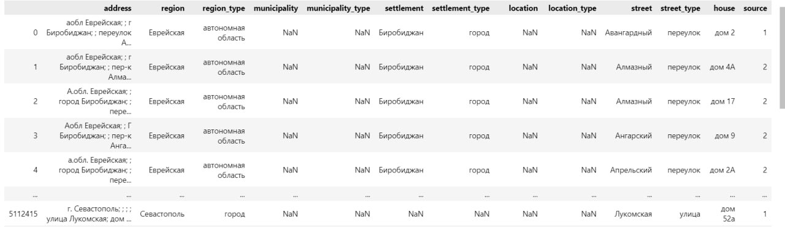

# RuCode7.0 Final. Нормализация адреса
## 1 место 🥇 (команда mr MISISter)

### Данные

- ``adddress`` - ненормализованный адрес
- ``sourse`` - источник данных
- остальные колонки - нормализованное представление адреса

### Архитектура
С помощью регулярных выражений парсятся префиксы строк трейна, которые подаются в алгоритм ахо-корасика для дальнейшего поиска максимальной подстроки в сыром адресе. Производится обработка для исправления краевых случаев

### Пути к данным
train.py берет файл по пути data/addresses-train.csv и сохраняет модель re_model.pkl  
predict.py берет файл по пути data/addresses-close.csv и подгружает модель re_model.pkl

